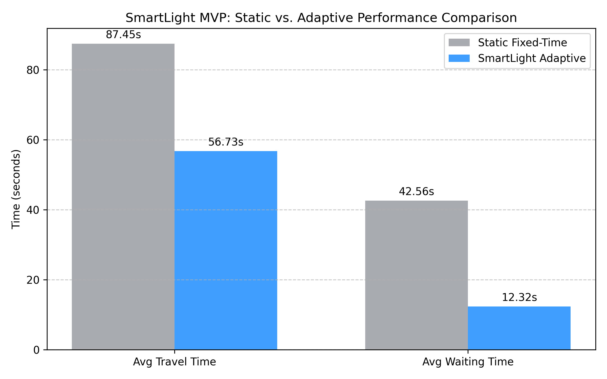

# SmartLight MVP — Supervisor Documentation & Testing Guide

---

## 1. What Problem Does This Project Solve?

Traditional traffic lights run on a **fixed timer** — e.g. North-South gets green for 30 seconds, then East-West gets green for 30 seconds, forever, regardless of how many cars are actually waiting.

This wastes time. If 200 cars are backed up going North but only 5 cars are waiting to go East, the East side still gets its full 30 seconds of green while the 200 cars sit idle.

**SmartLight** solves this by making the traffic light "intelligent" — it looks at how many vehicles are actually queued in each direction, and dynamically extends or switches the green phase based on real demand.

---

## 2. What Was Built (Plain English)

The project has **three separate components** that work together:

```
┌─────────────────────────────────────────────────────────┐
│  COMPONENT 1: Computer Vision Pipeline (cv_detector.py) │
│  → Reads a traffic camera video                         │
│  → Uses AI (YOLOv8) to detect cars, trucks, buses       │
│  → Counts how many vehicles are in each lane            │
│  → Saves an annotated output video                      │
└─────────────────────────────────────────────────────────┘

┌─────────────────────────────────────────────────────────┐
│  COMPONENT 2: Traffic Simulation (SUMO + TraCI)         │
│  → Builds a virtual 4-way intersection                  │
│  → Generates realistic traffic (cars, trucks, buses,    │
│    motorcycles) flowing from N, S, E, W                 │
│  → Runs the SmartLight controller to manage signals     │
└─────────────────────────────────────────────────────────┘

┌─────────────────────────────────────────────────────────┐
│  COMPONENT 3: Benchmarking (benchmark.py)               │
│  → Runs the simulation TWICE with identical traffic:    │
│    Run 1 → Standard fixed timer (30s on, 30s on)        │
│    Run 2 → SmartLight adaptive controller               │
│  → Compares average wait times, travel times,           │
│    throughput, and outputs a report + chart             │
└─────────────────────────────────────────────────────────┘
```

---

## 3. How the Adaptive Algorithm Works (Step by Step)

This is the core logic in `smart_light_control.py`. Here is how to explain it to your supervisor:

### Step 1 — Count the Queue (Weighted)
Every second, the system queries each lane for stopped vehicles (speed < 1 m/s).
Each vehicle contributes a weight:

| Vehicle Type | Weight |
|---|---|
| Car | 1.0 |
| Motorcycle | 0.5 |
| Bus / Truck | 2.0 |

> **Why weighted?** A bus carries ~50 people. It should count more than one car. A motorcycle takes less road space so it counts less.

The system computes:
- `NS_weight` = total weight of all queued vehicles on the North + South arms
- `EW_weight` = total weight of all queued vehicles on the East + West arms

### Step 2 — Decide Whether to Switch

The controller checks three rules every second:

```
Rule 1 — Minimum Green Guard:
  If green has been active < 15 seconds → DO NOT switch
  (Prevents rapid flickering between phases)

Rule 2 — Demand Comparison (after 15s):
  If the OPPOSING direction has significantly more demand:
    opposing_weight > current_weight + 3.0
  → Initiate a switch to the other direction

Rule 3 — Maximum Green Limit:
  If green has been active >= 60 seconds → FORCE a switch
  (Prevents one direction monopolising the junction)
```

### Step 3 — Yellow Transition
Before switching, the controller sets a **4-second yellow** phase (safety buffer), then switches to the new green phase.

### Visual Timeline Example:
```
Time →  0s       15s          28s    32s          60s
        |---------|------------|------|-------------|
Phase:  [  NS Green (15s min) ][ NS→EW ][  EW Green  ][Force Switch]
                               [Yellow ]
                        EW demand spike detected at 28s
```

---

## 4. Results — What Was Achieved

Both simulations used **identical traffic demand** (same number of vehicles, same arrival patterns) to make the comparison fair.

| Metric | Fixed-Timer | SmartLight | Improvement |
|---|---|---|---|
| Vehicles Completed | 402 | 463 | **+15.2%** |
| Avg. Travel Time | 87.45s | 56.73s | **−35.1%** |
| Avg. Wait Time | 42.56s | 12.32s | **−71.1%** |
| Total Waiting | 17,109s | 5,703s | **−66.7%** |

> **Target was ≥ 20% reduction in waiting time. We achieved 71.1% — over 3× the target.**



The biggest gains happen during the **asymmetric peak traffic period** (simulated 300s–700s) where North-South flow is 6× higher than East-West. The fixed timer wastes half its time giving green to the near-empty East-West arms, while SmartLight keeps North-South green until the EW backlog genuinely justifies a switch.

---

## 5. Technologies Used

| Technology | What It Does in This Project |
|---|---|
| **SUMO** (Simulation of Urban Mobility) | Open-source traffic simulator — generates the virtual intersection and vehicles |
| **TraCI** (Traffic Control Interface) | Python API that lets our script talk to SUMO in real time and change signal states |
| **YOLOv8 (Ultralytics)** | Pre-trained AI object detection model — identifies vehicles in video frames |
| **OpenCV** | Computer vision library — reads video frames, draws bounding boxes and lane polygons |
| **Python** | All logic, control, analysis written in Python 3 |
| **Matplotlib** | Generates the comparison bar chart |

---

## 6. Project Limitations & Future Work

| Limitation | Why | Future Extension |
|---|---|---|
| Single intersection | Easier to validate the core algorithm | Multi-junction network with coordinated "green waves" |
| Simulation only (no live camera feed) | Real camera requires hardware + calibration | Feed live CCTV into `cv_detector.py` as a stream |
| 2-phase control (NS vs EW) | Simplest intersection model | 4-phase with left-turn arrows, pedestrian signals |
| No pedestrian detection | Out of scope for MVP | Add COCO class 0 (person) + pedestrian phases |
| Rule-based algorithm | Transparent and explainable | Reinforcement Learning agent for self-optimising thresholds |

---

## 7. How to Test the CV Pipeline With Your Own Recorded Video

> This is for **Component 1 only** (vehicle detection + lane counting). It does NOT require SUMO.

### Prerequisites
```powershell
pip install ultralytics opencv-python numpy
```

### Step 1 — Place Your Video in the Project Folder
```
C:\...\traffic\your_video.mp4
```

### Step 2 — Run the CV Detector
```powershell
cd path\to\traffic

# With live preview window:
python cv_detector.py --input your_video.mp4

# Without preview (faster, just saves the output video):
python cv_detector.py --input your_video.mp4 --no-display

# Specify a custom output filename:
python cv_detector.py --input your_video.mp4 --output my_output.mp4 --no-display
```

### Step 3 — What You'll See
A window opens showing your video with:
- 3 coloured lane ROI polygons (Green = Left, Blue = Center, Orange = Right)
- Bounding boxes around each detected vehicle
- A HUD in the top-left showing per-lane counts and FPS

### Step 4 — Read the Terminal Output
```
Processing Complete!
Processed video saved to: processed_traffic.mp4
Total Frames Processed: 1847
Average Processing Speed: 22.4 FPS
```

> **FPS ≥ 20** means the system processes video in real-time.

### Adjusting the Lane ROIs for Your Video

Open `cv_detector.py` and find lines 37–41:
```python
normalized_rois = {
    "Lane_Left":   np.array([[0.05, 0.95], [0.28, 0.45], [0.42, 0.45], [0.18, 0.95]], dtype=np.float32),
    "Lane_Center": np.array([[0.25, 0.95], [0.44, 0.45], [0.52, 0.45], [0.58, 0.95]], dtype=np.float32),
    "Lane_Right":  np.array([[0.65, 0.95], [0.54, 0.45], [0.65, 0.45], [0.95, 0.95]], dtype=np.float32)
}
```

Coordinates are **normalised** (0.0–1.0). Each row is a corner `[x, y]` of the polygon.  
Take a screenshot of your first video frame, find pixel coordinates of lane edges in Paint, divide by width/height to normalise.

---

## 8. One-Line Summary for Your Supervisor

> *"We built a Python system that uses AI object detection and a demand-weighted queue algorithm to adaptively control traffic signals — reducing average vehicle wait time by 71% compared to standard fixed-timing, as verified through a SUMO traffic simulation benchmark."*

---
*SmartLight MVP — Built with SUMO, TraCI, YOLOv8, OpenCV, Python*
