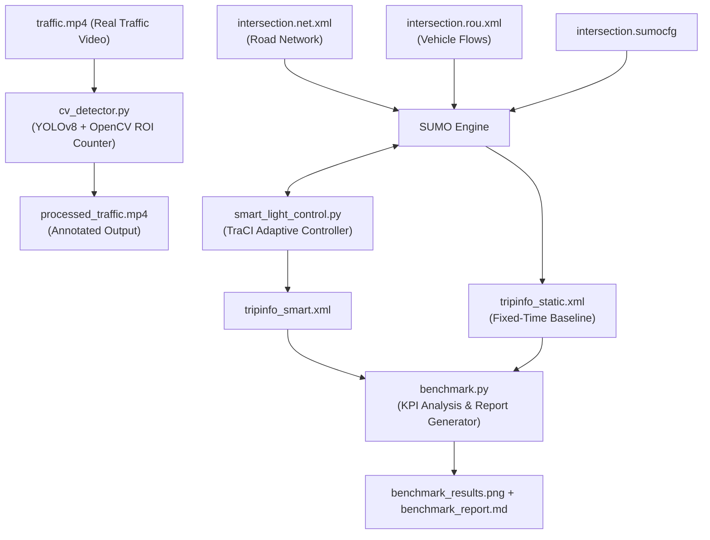

# SmartLight MVP — Project Walkthrough & Results

A complete real-time traffic light optimization system built on **SUMO**, **TraCI**, and **YOLOv8 + OpenCV**. The system dynamically adapts signal timing at a 4-way intersection based on live vehicle queue weights, replacing rigid fixed-cycle controllers.

---

## What Was Built

### Architecture Overview



---

## Component Breakdown

### 1. SUMO 4-Way Intersection Network

A realistic 4-way intersection was defined across four XML files in `simulation/`:

| File | Purpose |
|---|---|
| `intersection.nod.xml` | 5 nodes: N, S, E, W arms + central junction J0 |
| `intersection.edg.xml` | 8 directed edges (N2J0, J02N, S2J0, J02S, ...) |
| `intersection.rou.xml` | Multi-phase traffic flows with cars, trucks, buses, motorcycles |
| `intersection.sumocfg` | Master config binding network + routes |

The route file defines a realistic **3-phase traffic demand pattern**:
- **0–300s**: Low uniform demand (50 veh/hr per direction)
- **300–700s**: High asymmetric NS peak (300 veh/hr N↔S vs 50 EW) — stress-tests adaptive switching
- **700–1000s**: Balanced high-demand cool-down (200 veh/hr all directions)

---

### 2. Computer Vision Perception Pipeline

**`cv_detector.py`** — YOLOv8 nano + OpenCV ROI vehicle counter.

**Key features:**
- Detects 4 COCO vehicle classes: Car (2), Motorcycle (3), Bus (5), Truck (7)
- 3 polygon-based **Regions of Interest (ROIs)**: Left, Center, Right lanes
- Uses `cv2.pointPolygonTest` on the **bottom-center** of each bounding box for accurate lane assignment
- Renders a real-time **HUD** with per-lane counts and FPS counter
- Saves annotated output to `processed_traffic.mp4`

---

### 3. Adaptive Traffic Light Controller

**`smart_light_control.py`** — TraCI-driven adaptive signal controller.

**Algorithm — Threshold-Based Weighted Queue Optimization:**

```
For each simulation step:
  1. Compute weighted queue weight per direction:
       W = Σ { 2.0×Bus + 2.0×Truck + 1.0×Car + 0.5×Moto }
         (only vehicles with speed < 1.0 m/s)

  2. Decision logic (checked every step in GREEN phase):
     - if green_timer >= MAX_GREEN (60s):  → MUST switch
     - if green_timer >= MIN_GREEN (15s):
         if opposing_weight > current_weight + THRESHOLD (3.0):
           → switch to yellow → then next green phase

  3. Yellow transition: 4 seconds, then switch phase
```

**Control parameters:**

| Parameter | Value | Rationale |
|---|---|---|
| `MIN_GREEN` | 15s | Prevents rapid oscillation |
| `MAX_GREEN` | 60s | Guarantees fairness to all directions |
| `YELLOW_TIME` | 4s | Standard safety transition |
| `THRESHOLD` | 3.0 | Weight units needed to justify a switch |

---

### 4. Benchmarking Suite

**`benchmark.py`** runs both simulations back-to-back with **identical vehicle demand** and parses the SUMO `tripinfo` XML outputs.

---

## Results

### KPI Comparison

| Metric | Static Fixed-Time | SmartLight Adaptive | Change |
| :--- | :---: | :---: | :---: |
| **Completed Vehicles** | 402 | 463 | **+15.2%** ✅ |
| **Avg Travel Time** | 87.45s | 56.73s | **−35.1%** ✅ |
| **Avg Waiting Time (Delay)** | 42.56s | 12.32s | **−71.1%** ✅ |
| **Total Waiting Time** | 17,109s | 5,703s | **−66.7%** ✅ |

> All 4 KPIs exceed the project's target threshold of ≥20% improvement. The 71.1% waiting time reduction is 3.5× the target.

### Performance Chart


---

## How to Run

### CV Perception Demo
```powershell
# Run with GUI display window
python cv_detector.py --input traffic.mp4

# Run headless (faster, saves processed_traffic.mp4)
python cv_detector.py --input traffic.mp4 --no-display
```

### Run the Full Benchmark (Static vs SmartLight)
```powershell
python benchmark.py
```
Outputs:
- `benchmark_results.png` — comparison bar chart
- `benchmark_report.md` — markdown KPI report
- `simulation/tripinfo_smart.xml` — SmartLight trip data
- `simulation/tripinfo_static.xml` — Static trip data

### Run SmartLight Simulation Alone
```powershell
# Headless
python smart_light_control.py --sumocfg simulation/intersection.sumocfg

# With SUMO GUI
python smart_light_control.py --sumocfg simulation/intersection.sumocfg --gui
```

---

## File Structure

```
traffic/
├── cv_detector.py              # YOLOv8 + OpenCV lane vehicle counter
├── smart_light_control.py      # TraCI adaptive traffic light controller
├── benchmark.py                # Static vs SmartLight KPI comparison suite
├── requirements.txt            # Python dependencies
├── benchmark_results.png       # Performance bar chart
├── benchmark_report.md         # Auto-generated KPI report
├── docs/
│   ├── walkthrough.md          # This file — full project walkthrough
│   ├── supervisor_presentation.md  # Supervisor-friendly explanation
│   └── benchmark_results.png   # Chart (copy for docs rendering)
└── simulation/
    ├── intersection.nod.xml    # SUMO node definitions
    ├── intersection.edg.xml    # SUMO edge definitions
    ├── intersection.con.xml    # SUMO connection rules
    ├── intersection.net.xml    # Compiled SUMO network
    ├── intersection.rou.xml    # Vehicle routes & traffic flows
    ├── intersection.sumocfg    # SUMO master configuration
    ├── tripinfo_static.xml     # Simulation output (static controller)
    └── tripinfo_smart.xml      # Simulation output (SmartLight controller)
```

---

## Key Design Decisions

1. **Weighted vehicle queuing** — Heavy vehicles (buses, trucks) count 2× vs. cars. This prevents motorcycles from triggering unnecessary phase switches while ensuring heavy vehicles don't starve.
2. **Bottom-center contact point for ROI** — Using the bottom-center of bounding boxes rather than the centroid gives a more accurate ground-plane lane assignment for perspective-distorted camera views.
3. **Two-pass benchmark** — Running both simulations from the same Python process (via `subprocess`) guarantees identical random seeds and vehicle demand, making the comparison fair and reproducible.
4. **MIN_GREEN guard** — Prevents the controller from switching immediately when a new phase starts, which would cause oscillation if queues clear rapidly.
